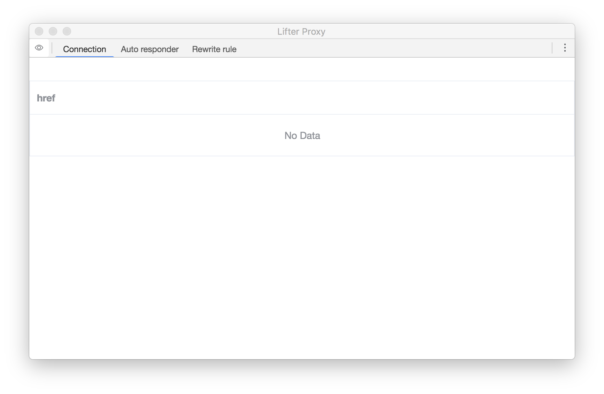

# Lifter proxy

Local Proxy for frontend developers.

Lifter proxy is built with [node-http-mitm-proxy](https://github.com/joeferner/node-http-mitm-proxy), [electron](https://github.com/electron/electron) and [vuejs](https://github.com/vuejs/vue)

## Installing

[Download the correct version](https://github.com/kyo-ago/lifter/releases/latest)

## Support Environment

* macOS 10.13.*

## Author

- [github/kyo-ago](https://github.com/kyo-ago)
- [twitter/kyo_ago](https://twitter.com/kyo_ago)

## License

GPL-3.0 © kyo-ago
